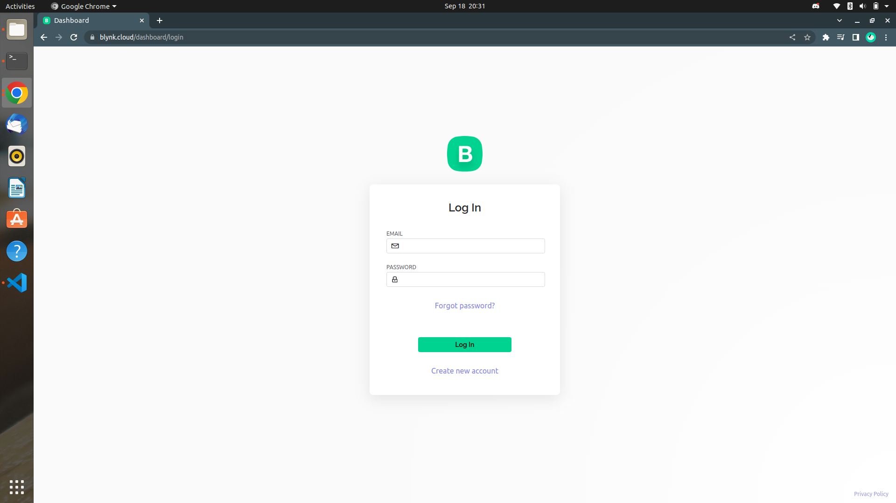
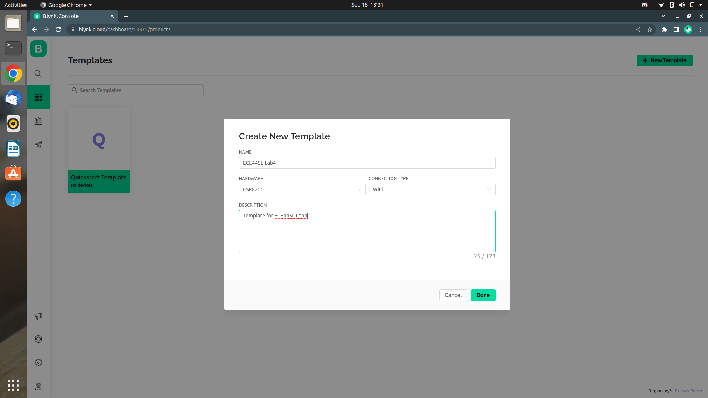
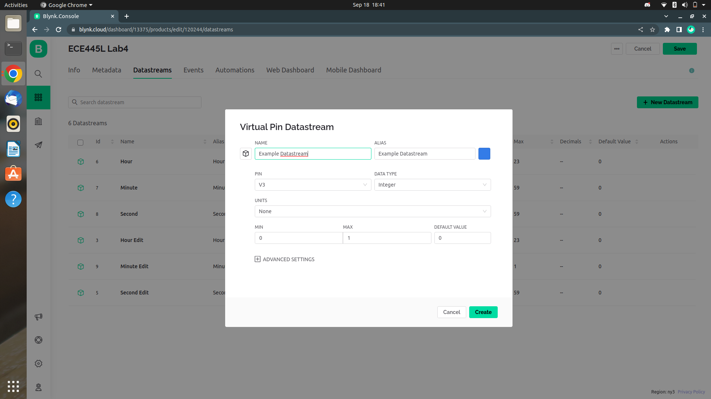
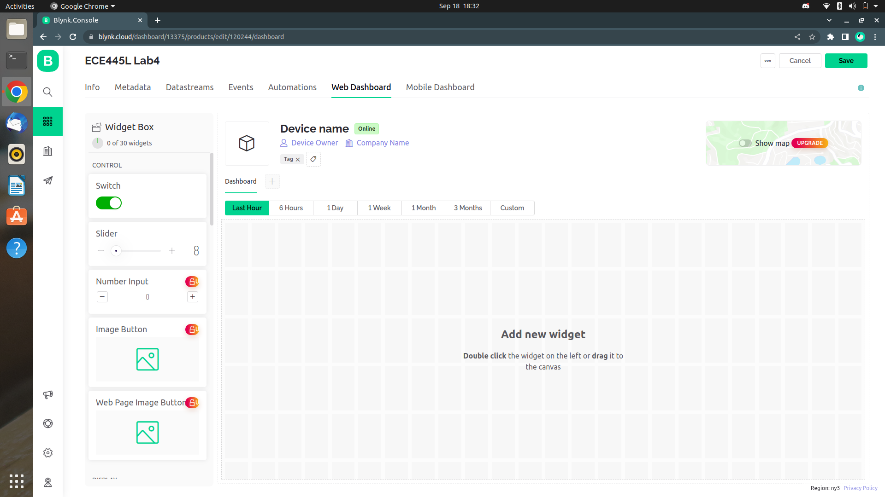
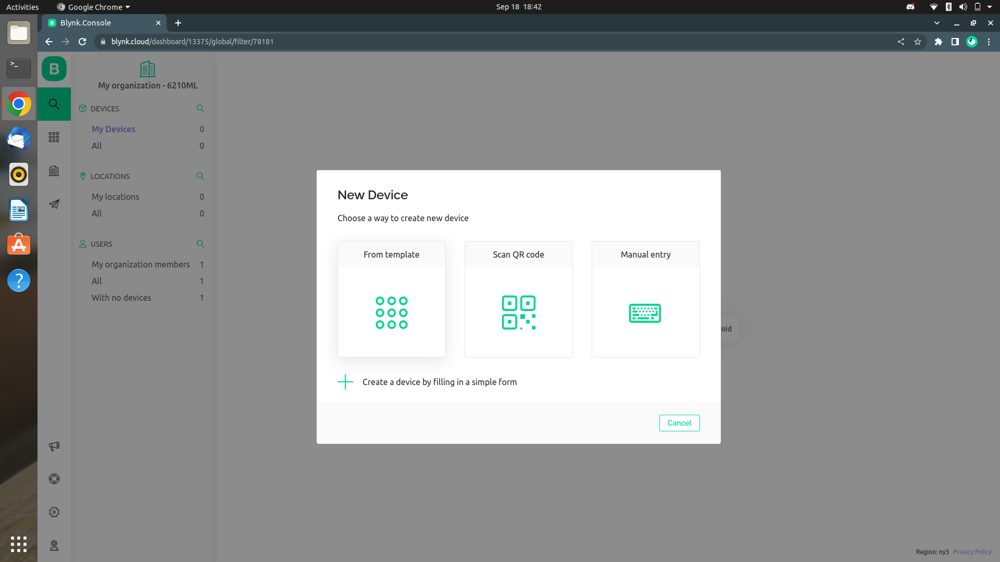
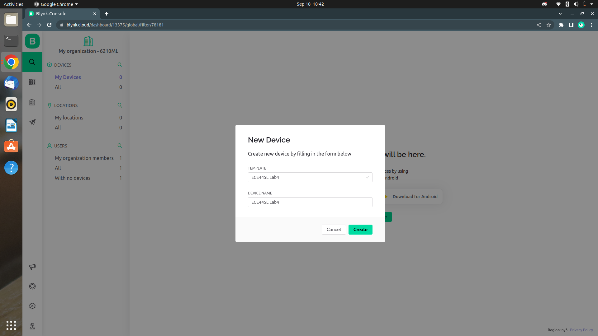
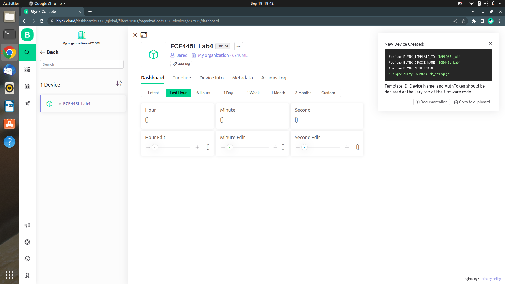
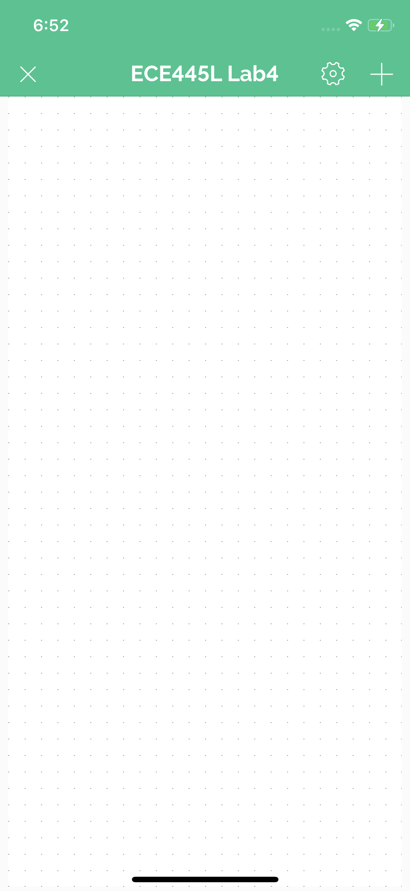
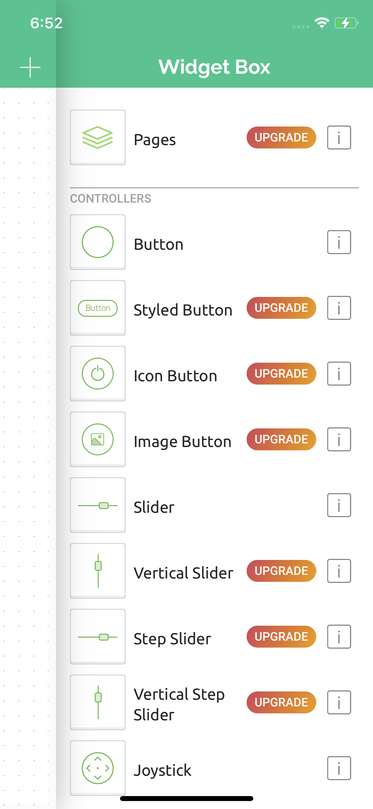
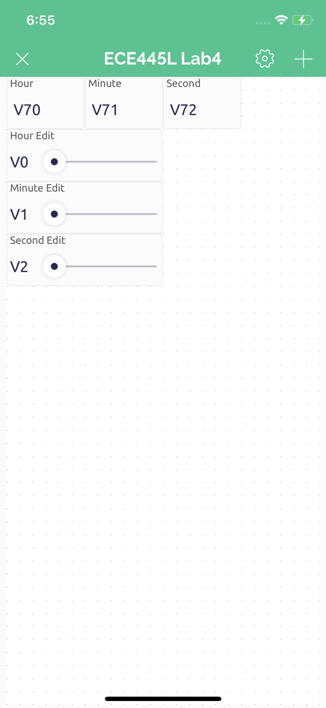

# Blynk.md

## Table of Contents
- [Blynk.md](#blynkmd)
  - [Table of Contents](#table-of-contents)
  - [Prerequisites](#prerequisites)
  - [Creating a Blynk Device](#creating-a-blynk-device)
  - [Connecting Blynk to the TM4C](#connecting-blynk-to-the-tm4c)
  - [Updating ESP8266](#updating-esp8266)

---  

## Prerequisites

1. Hardware is setup (TM4C hooked up to ESP8266 via UART)
2. ESP8266 is flashed with latest [firmware](https://github.com/ECE445L/EE445L-SP22-ESP8266-Blynk)
    1. See section [Updating ESP8266](#updating-esp8266)

---

## Creating a Blynk Device

1. Sign into Blynk

2. Create a template for your device
    1. Click the `Template` icon in the left taskbar
    2. Click the `+ New Template` button in the top right corner of the screen
    3. Name your template
    4. Select `ESP8266` as the hardware
    5. Click `Done`

3. Create datastreams for your widgets to connect to
    1. Click the `Datastreams` tab at the top of the screen
    2. Click the `+ New Datastream` button in the top right corner of the screen
    3. Name the datastream and select the virtual pin that it corresponds to
    4. Edit the rest of the datastream's settings as you like
    5. Click `Create`

4. Create a dashboard
    1. Click the `Datastreams` tab at the top of the screen
    2. Drag widgets from the widget box on the left of the screen
    3. Click a widget's `gear icon` to edit it
    4. Name the widget and set its corresponding datastream
    5. Click `Save`

5. Create a device
    1. Save the template you created by clicking the `Save` button in the top right corner of the screen
    2. Click the `Search` icon in the left taskbar
    3. Click the `+ New Device` button in the top right corner of the screen
    4. Select the `From template` option
    5. Select the template you created
    6. Name the device
    7. Copy the `BLYNK_AUTH_TOKEN` from the top right corner of the screen

6. Create a mobile dashboard
    1. Log into the mobile app
    2. Click the device that you created earlier
    3. Click the `wrench` button in the top right corner of the screen to edit the dashboard
    4. Click the `+` button in the top right corner of the screen to add a widget
    5. Click the widget to edit it
    6. Name the widget and set its corresponding datastream
    7. Click the `X` button in the top left corner to exit the editor

---

## Connecting Blynk to the TM4C

1. [Create a Blynk device](#creating-a-blynk-device)
2. You are provided a BLYNK template ID, device name, and auth token
    1. Only need the auth token
3. Use the blynk_init function call to pass in your auth token, SSID, and password to connect to Blynk!
	1. We suggest the SSID and PASS to correspond to the Lab IOT WiFi or a mobile hotspot
4. Compile and flash program to TM4C
5. If the HW is setup properly, then Blynk should say the device is online

---
## Updating ESP8266

1. Download the [Arduino IDE](https://www.arduino.cc/en/software)
    1. Last tested version: `1.8.19`
2. Add ESP8266 indices to Arduino board manager URLs `https://arduino.esp8266.com/stable/package_esp8266com_index.json`
    1. `File > Preferences > Additional Board Manager URLs:`
    2. Go to `Tools > Boards Manager`
    3. Search for `esp8266`
    4. Install `v3.0.2`
3. Add Blynk libraries
    1. `Tools > Manage Libraries...`
    2. Search for `blynk`, install `Blynk` by Volodymyr Shymanskyy v1.1.0
4. Change board to `esp8266`
    1. `Tools > Board: "xxx" > ESP8266 Boards (3.0.2) > Generic ESP8266 Module`
5. Clone latest [firmware](https://github.com/ECE445L/EE445L-SP22-ESP8266-Blynk)
6. Open up ESP_TM4C_Xfer_Rev_HandShake_NEW_BLYNK project
    1. `EE445L-F22-ESP8266-Blynk > ESP_TM4C_Xfer_Rev_HandShake_NEW_BLYNK > ESP_TM4C_Xfer_Rev_HandShake_NEW_BLYNK.ino`
7. Compile project (checkmark button)
8. Select port to flash to
    1. `Tools > Port: "xxx"`
    2. Select open port, assuming only one USB device is currently connected
9. Connect ESP8266 to ECE 445L ESP8266 flasher board (or similar UART-USB FTDI board)
10. Upload using flash button (rightward facing arrow).

